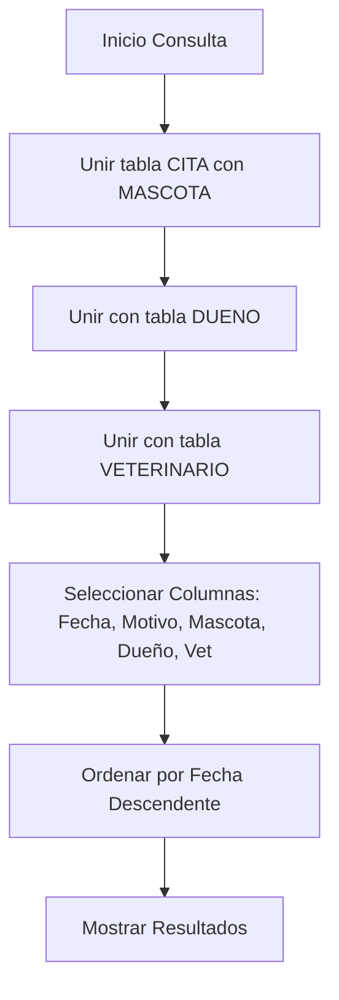
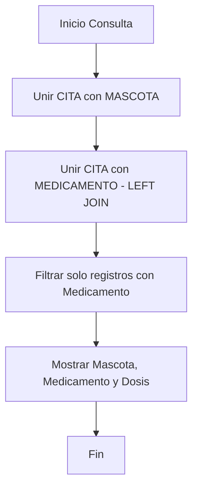
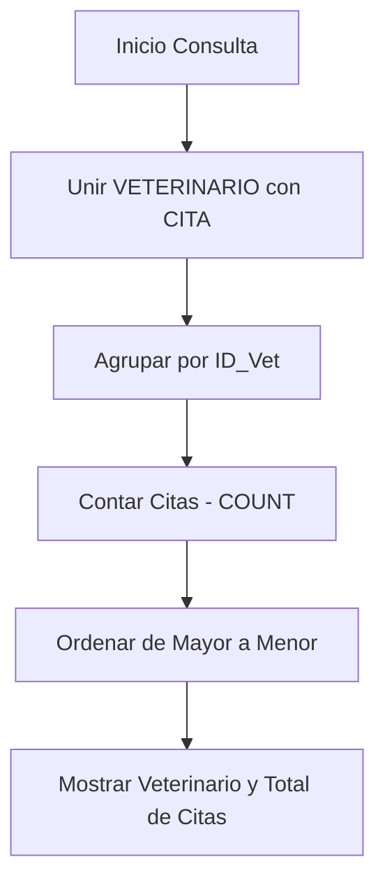

# Guía de Sustentación — Proyecto VetSystem 🐾

Este documento contiene todo lo necesario para cumplir con los requisitos de tu profesor y asegurar una excelente nota en la sustentación.

---

## ✅ Verificación de Requisitos

| Requisito | Estado | Detalle en el Proyecto |
| :--- | :---: | :--- |
| **Mínimo 5 tablas** | 🟢 OK | `DUENO`, `MASCOTA`, `VETERINARIO`, `MEDICAMENTO`, `CITA`. |
| **Mínimo 3 relaciones** | 🟢 OK | 4 relaciones implementadas con llaves foráneas (FK). |
| **10 registros por tabla** | 🟢 OK | He actualizado el script SQL con 10-12 registros por tabla. |
| **Mínimo 4 consultas SQL** | 🟢 OK | El proyecto incluye 5 consultas avanzadas con JOIN y filtros. |
| **Diagramas de flujo** | 🟢 OK | Incluidos a continuación en este documento. |
| **Script SQL exportado** | 🟢 OK | Archivo `bd_veterinaria.sql` listo en la carpeta raíz. |

---

## 📋 Consultas y Diagramas de Flujo

Tu profesor pide diagramas de flujo para las consultas. Aquí tienes la lógica de las consultas principales:

### Consulta 1: Citas Completas (4 tablas)
**Propósito**: Obtener el historial de citas mostrando el nombre de la mascota, el dueño y el veterinario que la atendió.

### Consulta 2: Medicamentos Prescritos
**Propósito**: Listar qué medicamentos se han recetado en las citas médicas.

### Consulta 3: Ranking de Veterinarios (Agregación)
**Propósito**: Saber cuántas citas ha atendido cada veterinario.

---

## 🚀 Consejos para la Sustentación

1.  **Explica las Relaciones**: Di que usaste una relación "Uno a Muchos" entre Dueño y Mascota (un dueño puede tener varias mascotas) y que la tabla CITA es la "tabla relacional" principal que une todo.
2.  **Muestra la Carpeta `consultas/`**: Entra a la página de "Consultas SQL" en el sistema para que el profesor vea que las consultas funcionan en tiempo real sobre la base de datos.
3.  **Integridad Referencial**: Menciona que usaste `ON DELETE CASCADE` en las llaves foráneas para que, si se borra un dueño, sus mascotas también se borren automáticamente (esto demuestra conocimiento avanzado).

---

### 📦 Archivos que debes entregar:
1.  La carpeta `veterinaria/` completa (comprimida en .zip).
2.  Este documento de guía o los diagramas exportados si te los pide en PDF.
3.  El archivo `bd_veterinaria.sql` (que ya está dentro de la carpeta).
